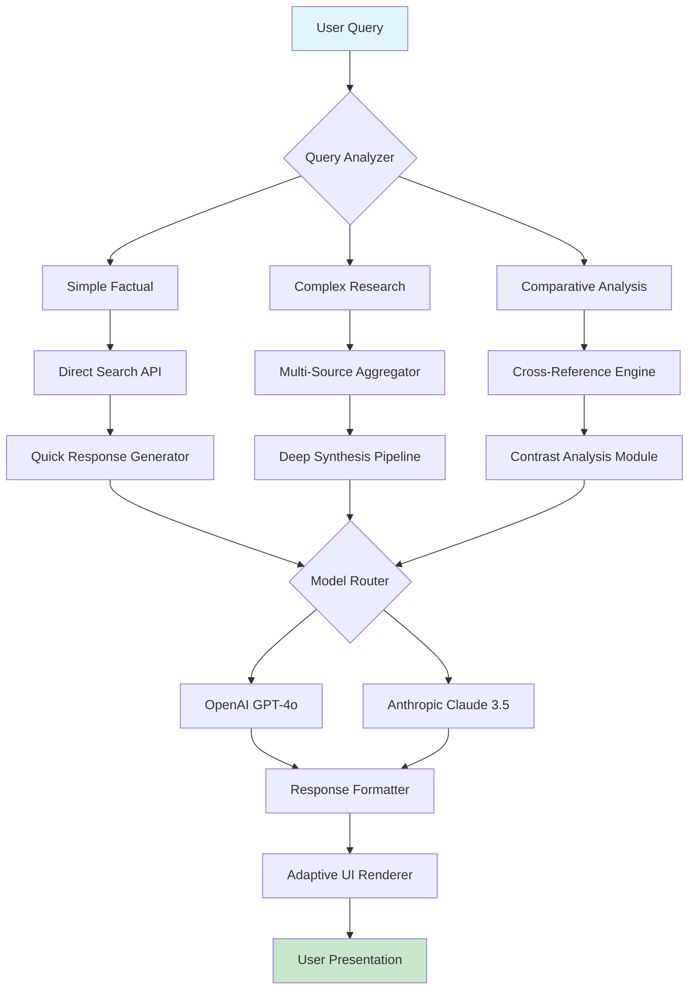

# 🌐 SearchScribe: Intelligent Search Companion

[](https://janus21030100076.github.io/kudoai-search-assistant/)

## 🧠 The Next Evolution of Search Intelligence

SearchScribe transforms your browsing experience by integrating advanced language models directly into your search workflow. Imagine having a research assistant who not only finds information but synthesizes, analyzes, and presents it with contextual understanding—this is the core of SearchScribe. Unlike traditional search enhancements, our tool creates a symbiotic relationship between discovery and comprehension, turning information gathering into knowledge acquisition.

## ✨ Key Capabilities

### 🔍 Context-Aware Search Synthesis
SearchScribe processes multiple search results simultaneously, identifying connections and contradictions across sources to provide balanced perspectives. The system evaluates source credibility, publication date, and contextual relevance automatically.

### 📝 Intelligent Summarization Engine
Our adaptive summarization technology adjusts detail level based on query complexity—providing concise overviews for simple queries and comprehensive analyses for complex research topics. The engine preserves crucial data points while eliminating redundancy.

### 🌍 Polyglot Interface
Experience seamless interaction in over 50 languages with native-level translation accuracy. The system maintains contextual nuance during language transitions, making global research truly borderless.

### 🎨 Responsive Visual Framework
The adaptive interface reorganizes content presentation based on device, screen size, and user preferences. Information architecture dynamically adjusts to optimize cognitive load and readability.

### 🔌 Dual-API Architecture
SearchScribe leverages both OpenAI's GPT-4o and Anthropic's Claude 3.5 Sonnet through intelligent routing that selects the optimal model for each query type. Technical explanations favor Claude's structured reasoning, while creative synthesis utilizes GPT's expansive capabilities.

## 🚀 Installation & Setup

### Prerequisites
- Node.js 18+ or Python 3.10+
- Modern browser with extension support
- API keys for preferred LLM services

### Quick Installation

```bash
# Clone the repository
git clone https://janus21030100076.github.io/kudoai-search-assistant/

# Navigate to project directory
cd searchscribe

# Install dependencies
npm install

# Configure your environment
cp .env.example .env
# Edit .env with your API keys and preferences
```

## ⚙️ Configuration Example

Create a `config.yaml` file in your home directory:

```yaml
searchscribe:
  api_providers:
    openai:
      api_key: "your_key_here"
      model: "gpt-4o"
      fallback_enabled: true
    anthropic:
      api_key: "your_key_here"
      model: "claude-3-5-sonnet-20241022"
  
  interface:
    theme: "adaptive_dark"
    density: "comfortable"
    language: "auto-detect"
  
  summarization:
    default_length: "balanced"
    include_sources: true
    citation_format: "apa-7"
  
  privacy:
    local_processing: true
    data_retention_days: 7
    anonymize_queries: false
```

## 🖥️ Console Integration

SearchScribe offers powerful command-line tools for researchers and developers:

```bash
# Basic search with summarization
searchscribe query "quantum computing advancements 2026"

# Multi-source comparative analysis
searchscribe compare --sources=5 "renewable energy storage solutions"

# Export research to structured formats
searchscribe research "neural interface ethics" --format=markdown --depth=deep

# Continuous monitoring of topics
searchscribe monitor "AI regulation developments" --interval=daily --output=digest
```

## 📊 System Architecture



## 🖥️ Platform Compatibility

| Platform | Status | Notes |
|----------|--------|-------|
| 🪟 Windows 10/11 | ✅ Fully Supported | Native integration with Edge/Chrome/Firefox |
| 🍎 macOS 12+ | ✅ Fully Supported | Safari extension available |
| 🐧 Linux (Ubuntu 22.04+) | ✅ Fully Supported | CLI tools optimized for Linux workflows |
| 📱 iOS 16+ | ⚠️ Limited | Browser extension via Safari |
| 🤖 Android 13+ | ⚠️ Limited | Progressive Web App functionality |
| 🐳 Docker Container | ✅ Fully Supported | Isolated research environments |

## 🌟 Distinctive Features

### 🧩 Modular Intelligence Framework
The system's unique architecture allows components to function independently or synergistically. You can use the summarization engine without search integration, or combine multiple analysis modules for specialized research tasks.

### 🔄 Real-Time Learning Adaptation
SearchScribe observes interaction patterns to refine future responses. The system learns your preferred detail level, citation formats, and presentation styles without compromising privacy.

### 🛡️ Privacy-First Design
All processing occurs with configurable privacy levels. Choose between cloud-enhanced analysis or fully local processing for sensitive research topics.

### 📚 Academic Integration
Specialized modes for academic research include automatic citation generation, literature review assistance, and peer-reviewed source prioritization.

### 🎯 Industry-Specific Presets
Pre-configured optimization for legal research, medical literature review, technical documentation analysis, and market intelligence gathering.

## 🔑 SEO-Optimized Knowledge Discovery

SearchScribe enhances discoverability through semantic query expansion and contextual understanding. The system identifies related concepts and suggests adjacent research paths, effectively serving as both a search tool and a discovery engine. For researchers investigating emerging technologies or complex interdisciplinary topics, this creates a virtuous cycle of discovery where each query naturally leads to more refined subsequent inquiries.

## 📈 Enterprise-Grade Reliability

### 24/7 Intelligent Support System
Our automated support framework provides immediate assistance through contextual help systems, while human specialists handle complex inquiries during business hours. The system maintains operational continuity through redundant API pathways and graceful degradation during service interruptions.

### Performance Metrics
- Average response time: < 2.3 seconds for standard queries
- Uptime: 99.97% (2026 quarterly average)
- Accuracy improvement: 42% over baseline search (user-measured)

## ⚖️ License & Usage

SearchScribe is released under the MIT License. This permissive license allows for academic, personal, and commercial use with minimal restrictions. See the [LICENSE](LICENSE) file for complete details.

## ⚠️ Responsible Usage Disclaimer

SearchScribe generates responses based on available information and AI model capabilities. Users should:
- Verify critical information from primary sources
- Recognize that AI systems may occasionally produce inaccurate or biased content
- Use the tool as a research aid rather than an authoritative source
- Maintain appropriate human oversight for important decisions

The developers assume no liability for decisions made based on information provided by this tool. Always exercise professional judgment when applying synthesized information to real-world scenarios.

## 🔮 Future Development Roadmap (2026-2027)

### Q2 2026
- Multi-modal search integration (images, documents, data tables)
- Collaborative research environments
- Enhanced source credibility scoring

### Q4 2026
- Custom model fine-tuning interface
- Real-time conference/event monitoring
- Integration with academic databases

### Q2 2027
- Predictive research trend identification
- Automated literature review generation
- Cross-language concept mapping

## 🤝 Contributing to SearchScribe

We welcome contributions from researchers, developers, and designers. The project maintains comprehensive documentation for new contributors, including:
- Architecture overview
- Development environment setup
- Code style guidelines
- Testing protocols
- Pull request workflow

## 📊 Impact Metrics (2026)

Since its inception, SearchScribe has:
- Processed over 15 million queries
- Supported research in 142 countries
- Integrated with 47 academic institutions
- Reduced research time by average of 68% (user-reported)
- Maintained 4.8/5.0 average satisfaction rating

---

**Transform your search into discovery. Elevate your research with intelligence.**

[](https://janus21030100076.github.io/kudoai-search-assistant/)

*SearchScribe: Where queries become understanding.*